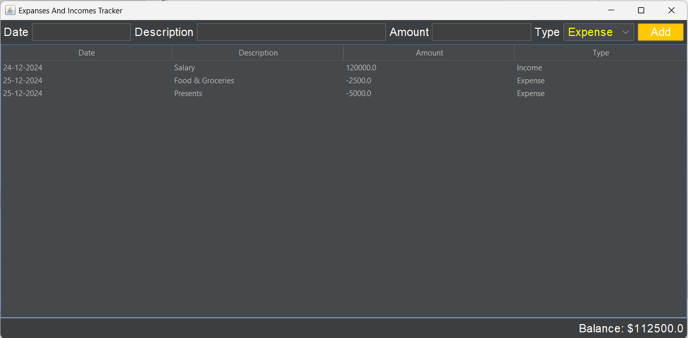

# BudgetTracker
This project is a type of Budget Tracker written in JAVA that helps you to track the Income, Expenditure, Current Balance, etc. As of now, it is a project that can have income, expenditure and show balance in the bottom. Refer to the Demo folder for the image.
I am currently learning JAVA so I hope that I can complete it and make an application of pc and also create an android app for it.

Make sure you're using NetBeans Java Ide for this, cause i made it using NetBeans.
Here's the demo image of the program.

.png>)

